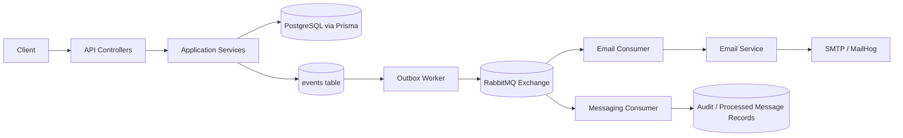

# Banking Backend

A NestJS-based banking backend project.  
Main focus: secure transaction flows, event-driven architecture, and testability.

## Quick Summary

This backend provides core banking APIs for authentication, accounts, and transactions (`deposit`, `withdraw`, `transfer`) with PostgreSQL/Prisma as the source of truth. It also includes Redis-based control layers (rate limiting and idempotency) and RabbitMQ-based asynchronous processing.

The project is structured around reliability patterns used in practical systems: outbox publishing, consumer deduplication, retry/backoff handling, and consistent API response envelopes for success and error paths.

> Note: This is a learning and testing project. It is not used in a live banking environment.

## Problem

This project addresses common backend needs in transaction-based systems:

- handling core money operations in a consistent way,
- reducing duplicate effects from repeated requests,
- keeping async side effects (such as audit logs and notifications) aligned with core data.

The goal is to provide a practical and understandable foundation that can be tested and extended over time.

## Features

- JWT-based authentication (`register`, `login`, `refresh`, `logout`)
- Account management and money operations (`deposit`, `withdraw`, `transfer`)
- Fraud checks
- Outbox + RabbitMQ event publish/consume flow
- Redis-backed idempotency and rate limiting controls
- Email notification consumer (SMTP is active, SendGrid exists but is not implemented)

This project focuses on reliability and security for real-world transaction workflows.

## Tech Stack

- Node.js + TypeScript
- NestJS
- PostgreSQL + Prisma
- Redis
- RabbitMQ
- Jest (unit + e2e/integration)

## Quick Start

### 1) Start infrastructure services

```bash
docker compose up -d
```

To stop:

```bash
docker compose down
```

### 2) Prepare environment variables

macOS/Linux:

```bash
cp .env.example .env
```

Windows PowerShell:

```powershell
Copy-Item .env.example .env
```

### 3) Install dependencies

```bash
npm install
```

### 4) Prepare Prisma and database

```bash
npm run prisma:generate
npm run prisma:migrate:dev
```

### 5) Run the application

```bash
npm run start:dev
```

The default port is managed by the `PORT` env variable (commonly `3000`).

## Architecture

- HTTP requests are handled by `app`, `auth`, `users`, `accounts`, and `transactions` modules
- Critical domain events are written to the `events` table
- `outbox.worker` publishes pending events to RabbitMQ
- Consumers (audit/email) process these events
- Email delivery flows through `EmailConsumer -> EmailService -> SMTP transport`

Flow:

`API -> DB Transaction -> Outbox -> RabbitMQ -> Consumers (Audit/Email)`

### Flow Diagram



## Project Structure

```text
src/
  auth/                 # auth endpoints, guards, token lifecycle
  users/                # current user profile + password operations
  accounts/             # account APIs and lifecycle (freeze/unfreeze/close)
  transactions/         # transaction commands and business logic
  fraud/                # fraud policy checks
  outbox/               # outbox polling, claiming, publish retries
  messaging/            # RabbitMQ connection, publisher, consumer infra
  notifications/
    email/              # email consumer, templates, SMTP/SendGrid transports
  common/               # filters, interceptors, middleware, shared contracts
  prisma/               # Prisma service/bootstrap
  redis/                # rate limit and idempotency helpers

prisma/
  schema.prisma         # database schema
  migrations/           # migration history
```

## Response Contract

Most endpoints return a consistent response envelope.

Exceptions:

- `GET /metrics` returns raw Prometheus text output
- Some middleware-level short-circuit responses (for example global rate limiting `429`) may return a minimal JSON payload

### Success Response

```json
{
  "success": true,
  "data": {
    "message": "Customer registered successfully"
  },
  "meta": {},
  "timestamp": "2026-04-08T12:34:56.789Z",
  "path": "/auth/register"
}
```

### Error Response

```json
{
  "success": false,
  "error": {
    "statusCode": 401,
    "message": "Invalid credentials"
  },
  "timestamp": "2026-04-08T12:35:01.120Z",
  "path": "/auth/login"
}
```

## API Endpoints

### System

- `GET /` - service info/root message
- `GET /health` - readiness + app metrics snapshot
- `GET /metrics` - Prometheus-compatible metrics

### Auth

- `POST /auth/register` - create a new customer account
- `POST /auth/login` - issue access token + refresh token
- `POST /auth/refresh` - rotate refresh token, issue new access token
- `POST /auth/logout` - revoke current refresh token

### Users (JWT required)

- `GET /users/me` - current user profile
- `PUT /users/me` - update current user profile
- `PATCH /users/me/password` - change current user password

### Accounts (JWT required)

- `GET /accounts` - list customer accounts
- `GET /accounts/:id` - get account details
- `POST /accounts` - create account
- `PATCH /accounts/:id/freeze` - freeze account
- `PATCH /accounts/:id/unfreeze` - unfreeze account
- `PATCH /accounts/:id/close` - close account

### Transactions (JWT required)

- `POST /transactions/deposit` - deposit to account
- `POST /transactions/withdraw` - withdraw from account
- `POST /transactions/transfer` - transfer between accounts

## Reliability & Security

- Outbox pattern to reduce message loss/duplication risk
- Consumer deduplication/idempotency via processed-message records
- Transaction-side idempotency checks and retry mechanisms
- Refresh token hashing and rotation
- Login lockout and rate limit guards
- Global validation pipe and consistent success/error response structure

## Failure Modes

This service is designed to degrade gracefully when infrastructure components fail.

### Redis Unavailable

- **Global rate limit**: middleware logs a warning and continues request processing (fail-open).
- **Transaction idempotency guard**: guard logs a warning and skips Redis-based idempotency checks (fail-open).
- **Login rate limit**: falls back to DB account lock checks; if DB fallback also fails, request is allowed and warning is logged.

### RabbitMQ Unavailable or Unstable

- Consumers retry bootstrap periodically until RabbitMQ becomes ready.
- Consumer processing classifies transient errors and schedules retry republish up to configured max retries.
- If retries are exhausted, messages are nacked with `requeue=false` and routed to DLQ behavior configured in topology.
- Safe `ack/nack` wrappers avoid hard crashes during shutdown races (for example, channel closing during teardown).

### Outbox Publish Failures

- Events are claimed and moved to `PUBLISHING` state before publish attempts.
- On publish failure, event is marked `FAILED` and retried with exponential backoff until max retries.
- Claim TTL allows stale `PUBLISHING` rows to be reclaimed.
- If publish succeeds but DB finalize fails, event is **not** downgraded to `FAILED` to avoid duplicate publish side effects.

### Email Delivery Failures

- Email consumer deduplicates messages via `processed_messages` claim/complete/fail lifecycle.
- Transient send/processing errors are retried via republish logic up to max retry count.
- Permanent failures are nacked and handled by queue/DLQ policy.
- Email sending can be disabled via `EMAIL_ENABLED=false` (useful in tests and controlled environments).

## Trade-offs

| Decision | Benefit | Cost |
| --- | --- | --- |
| Redis-dependent controls can fail open | API remains available during Redis outages | Temporary reduction in strict protection |
| Login guard falls back to DB checks | Better user continuity if Redis is down | Abuse resistance may weaken in fallback paths |
| Outbox + dedup (at-least-once) | Practical reliability for async delivery | More state and operational complexity |
| Locking/claim/retry mechanisms | Better consistency under contention | Higher latency and tuning overhead |
| Async pipeline (`outbox -> RabbitMQ -> consumers`) | Decoupling and better recovery behavior | Harder tracing/debugging across components |
| Test defaults can disable email delivery | More stable and less flaky CI | Less provider-realistic behavior in every run |

## Email System

- Email events: `transaction_completed`, `transaction_failed`, `user_registered`
- Queue: `notifications.email.q`
- Default provider: `smtp`
- In development, MailHog can be used for testing (`http://localhost:8025`)
- `sendgrid` provider is available as an option, but `src/notifications/email/sendgrid-email.transport.ts` is currently a stub

### SendGrid Status

SendGrid is a stub to keep local development simple and deterministic while SMTP/MailHog is used as the default path.

To activate SendGrid in this project:

1. Implement `send()` in `src/notifications/email/sendgrid-email.transport.ts`.
2. Set `EMAIL_PROVIDER=sendgrid`.
3. Set `SENDGRID_API_KEY` and a valid `EMAIL_FROM`.
4. Run an e2e/integration verification for email flow before using it in production.

## Scripts

### Daily

- `npm run start:dev` - run the backend in watch mode
- `npm run test:e2e:core` - run core e2e flows
- `npm run test:integration` - run integration suite
- `npm run lint` - run lint fixes

### Application

- `npm run start` - starts the app
- `npm run start:dev` - watch mode
- `npm run start:debug` - debug + watch
- `npm run start:prod` - runs the compiled app
- `npm run build` - builds the project
- `npm run lint` - runs eslint (with auto-fix)
- `npm run format` - runs prettier formatting

### Test

How to run tests in practice:

1. Start infrastructure first:

```bash
docker compose up -d
```

2. Run the fast baseline (unit):

```bash
npm run test
```

3. Run core end-to-end coverage:

```bash
npm run test:e2e:core
```

4. Run integration suites:

```bash
npm run test:integration
```

5. (Optional) Run all e2e:

```bash
npm run test:e2e
```

Targeted Test Commands:

- `npm run test:watch` - unit tests in watch mode
- `npm run test:cov` - unit coverage
- `npm run test:e2e:auth` - auth e2e suite
- `npm run test:e2e:users` - users e2e suite
- `npm run test:e2e:accounts` - accounts e2e suite
- `npm run test:e2e:transactions` - transactions e2e suite
- `npm run test:e2e:contract` - response contract e2e suite
- `npm run test:integration:db` - DB integration checks
- `npm run test:integration:auth` - auth token lifecycle integration checks
- `npm run test:integration:accounts` - account invariant integration checks
- `npm run test:integration:redis` - Redis-related integration checks

### Prisma

- `npm run prisma:generate`
- `npm run prisma:migrate:dev`
- `npm run prisma:migrate:deploy`
- `npm run prisma:studio`

## License

UNLICENSED
